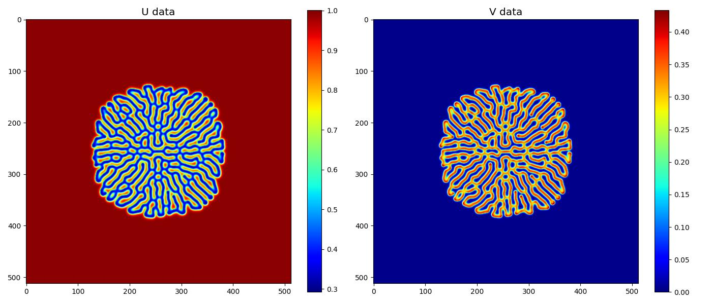
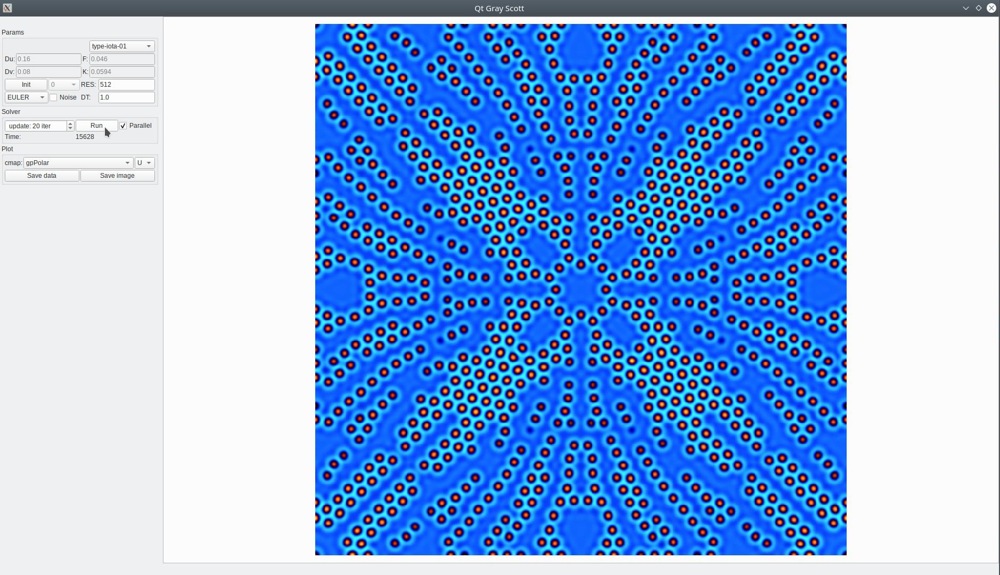

# GrayScott

## Program: gray_scott_cpp

### Build:
```
$ cd cpp 
$ mkdir build && cd build 
$ cmake ..
$ make 
```

### Run
```
$ ./gray_scott_cpp --f 0.055 --k 0.062 --o data
```
#### Help
```
./gray_scott_cpp --help
Unknow parameter '--help'
Info: 
Arguments:
        --dt    Help: Time step [seconds]. Default ( 1.0 )
         --f    Help: f-param. Default ( 0.055 )
         --k    Help: k-param. Default ( 0.062 )
    --method    Help: Method. 0-Euler 1-SymRK2. Default ( 0 )
        --mu    Help: U difussion coef. Default ( 0.16  )
        --mv    Help: V difussion coef. Default ( 0.08 )
         --n    Help: Resolution. Default ( 512 )
     --noise    Help: Add noise to the initial condition. Default ( 1 )
    --nsteps    Help: No. steps. Default ( 10000 )
         --o    Help: Output folder. Default ( ./  )
   --pattern    Help: Initial condition pattern [0,1,2]. Default ( 0 )
        --sv    Help: Save partial solution every `sv` steps. Default ( -1 )
```
### Outputs

The output of the program consists of binary files containing the function $u(x,y,t)$ and $v(x,y,t)$. 

Example:     
* UITER00000100 -> $u(x,y)$ at iteration 100 
* VITER00000100 -> $v(x,y)$ at iteration 100

### Data visualization
### Plot:
```
python3 plot.py --u data/UITER00000100 --v data/VITER00000100 --cmap jet 
```


### Animation:
```
python3 anim.py --folder data --cmap hot 
```
Use the `--sv` with program  `gray_scott_cpp`  option to control the number of saved partial solutions. 
You can see some animation here:
* [f=0.058 k=0.063](https://www.youtube.com/watch?v=AXQtNAJQK_k)
* [ f=0.030 k=0.055](https://www.youtube.com/watch?v=Ekct6MDxsTc)
* [f=0.014 k=0.047](https://www.youtube.com/watch?v=Cve-uqOWUz8) 
* [f=0.014, k=0.053](https://www.youtube.com/watch?v=krdEEUyB0vg)

#### Create video:
```
python3 to_movie.py --folder data --cmap hot --output animation.mp4 
``` 

## Program: qt_gray_scott 

This program is a GUI for the `gray_scott_cpp` program. You must use QtSDK 6.4 to compile the program.
```
$ cd qt_app 
$ qtcreator CMakeLists.txt
```

See simple [demo](https://www.youtube.com/watch?v=lLWhzkQdihs).
